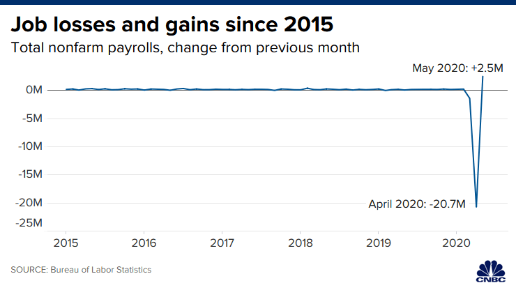

# CS-5630 / CS-6630 - Visualization for Data Science Homework 1

*Due: Friday, September 2, 11:59 pm.*

In this assignment, you will write a report that critiques and redesigns two visualizations. We provide the first visualization, and you will have to find the second on your own. The goal for this assignment is to get into the mindset of thinking critically about visualizations.

## Critique Guidelines

Critique the visualization, based on the following questions: 
1. What data is represented in this visualization? Be specific. 
2. What questions does the visualization answer?
3. Describe one aspect of the visualization that is effective.
4. Describe one aspect of the visualization that is *not* effective.
5. Why do you like/dislike the visualization?

## Redesign Guidelines

Your redesign should be submitted as an image showing a low-fidelity mock-up of your visualization as well as a text description of the design. The mock-up is not expected to be polished. In fact, the preferred way to create this would be to draw it by hand and take a picture. You can use any software to create the image, but you should not write code to create it. While this image is not intended to look like a final product, it should be clear what the proposed design would look like. In addition, your text description should explain why you redesigned the visualization in this way. That is, what are the advantages of showing the data in this way.

## Problem 1: Job Losses and Gains

Please critique and redesign the following visualization by CNBC. 

## Problem 2: Select, Critique, and Redesign a Visualization

You have a lot of freedom when picking a visualization to critique. That said you should pick something complex enough to have an interesting critique and redesign. The visualization you pick doesn't have to be fundamentally flawed. As a rule of thumb, try to pick a visualization that you find interesting in some way. In your report, you should include a static image of this visualization as well as a link to where the visualization came from.

## Submitting your work

Submit your final report as a PDF on Canvas. Include the following sections in your report:

- Title Section - should include your name, your e-mail address, and your UID
- Problem 1
    - Critique 1
    - Redesign 1
- Problem 2
    - Your selected visualization
    - Reference / link to your visualization
    - Critique 2
    - Redesign 2

## Grading
Your score on this assignment will be as follows:

 - 25%: Critique of provided visualization.
 - 25%: Redesign of provided visualization.
 - 10%: Selection of visualization. 
 - 20%: Critique of your selected visualization. 
 - 20%: Redesign of your selected visualization.
