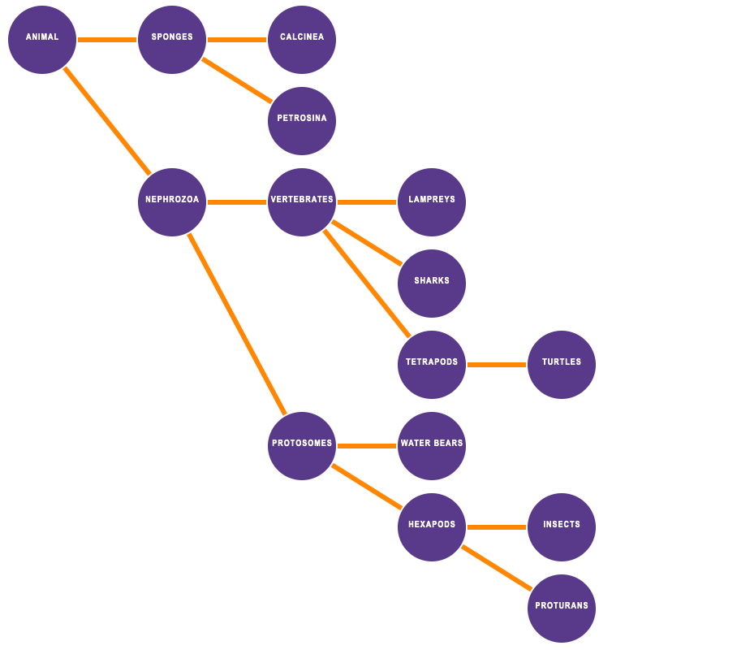
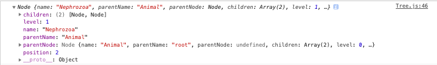
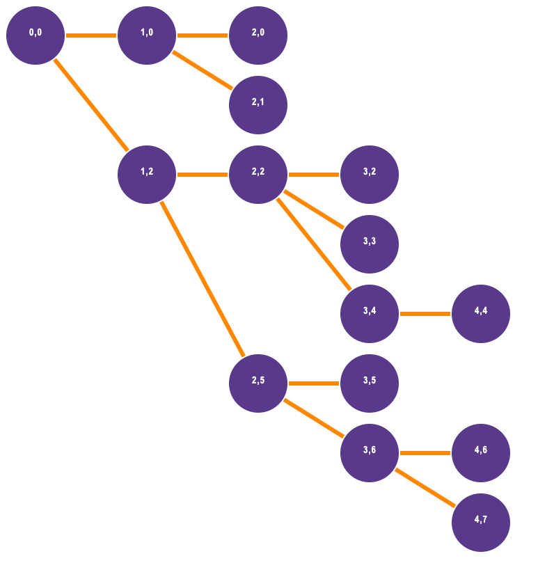
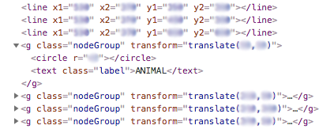
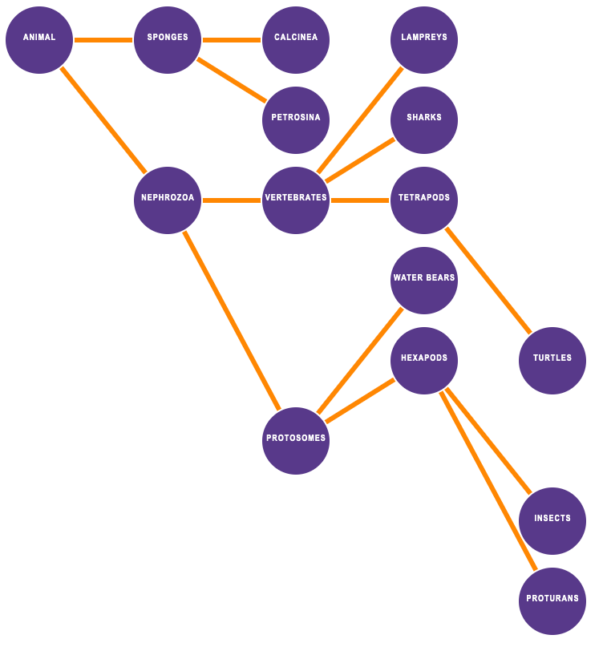

# CS-5630 / CS-6630 Homework 2
*Due: Friday, September 9, 11:59 pm.*

In this assignment we will use JavaScript to create a tree data structure, and render that tree to the browser with the D3 library.

Add name, e-mail address, and  UID to the HTML elements at the top. Also make sure the submission is a valid HTML5 file. Check that it is valid by uploading it to the [W3C HTML Validator](https://validator.w3.org/#validate_by_upload).

The project structure looks like this:

    hw2/
        README.md
        hw2.html
        js/
            Node.js
            Tree.js
            script.js
        data/
          Tree.json

All work for this HW will be in the `js/Tree.js` file. All other necessary code has been provided.

Remember, to be able to access the data files with JavaScript, we will need to be *serving* the hw2 directory, not just opening the HTML file in a browser. If your development environment doesn't provide a built-in server, start one with one of these commands:

    $ cd path/to/hw2
    # for python 2
    $ python -m SimpleHTTPServer 8080
    # for python 3
    $ python -m http.server 8080

View the page at [http://localhost:8080](http://localhost:8080)

When making changes to code, *[Hard Refresh](https://www.documate.org/resources/what-is-a-hard-refresh-how-to-do-a-hard-refresh-in-any-browser)* is very useful to see any changes in the browser. This will clear the browser cache on the current page and force the browser to use new scripts and styles for the page. This is different from the regular "Refresh".

In this assignment we will be using JavaScript classes, as covered in lecture. The homework consists of two parts:

1. manipulating data with JavaScript, and
2. rendering elements to the browser using basic D3 functionality.

The final tree should look similar to this one:




## The Data and the Data Structure

`Tree` and `Node` are names of the data structure we are using in this assignment. A tree knows all the nodes in the tree, and each node knows its parent and children. In the above diagram, the purple circles are the nodes, and they are connected by lines into a tree.

The source data from which to construct the tree lives in the `data/Tree.json` file (see snippet below). This JSON file contains a list of objects, where each object has a name, and references the name of its parent.

```JSON
[{
   "name":"Animal",
    "parent":"root"
  },
  {
    "name":"Sponges",
    "parent":"Animal"
  },
  {
    "name":"Nephrozoa",
    "parent":"Animal"
  },...
```

The `Node` class has been provided in the `js/node.js` file and will be used as the data structure of the nodes in the tree. The constructor of the `Node` class takes in two parameters: the name of the node as a string, and the name of the parent, also as a string.

```JS
// Node Class
constructor(nodeName, parentName) {

  /** String of Node Name */
  this.name = nodeName;

  /** String of Parent Name */
  this.parentName = parentName;

  /** Reference to parent Node Object. */
  this.parentNode = null;

  /** Array of Children. */
  this.children=[];

  /** Level of the node. */
  this.level=null;

  /**
    * Position of the node.
    * Initialize to -1
    */
  this.position=-1;
}

```

Notice that there are both `level` and `position` attributes. The level refers to how deep in the tree a given node is (where the root is level 0), while the position refers to where a given node is in relation to other nodes in the same level. These two attributes will be important when rendering the tree.

The `Tree` class will have two main functions:

1. `buildTree()` - The **data wrangling** function, where we will create a tree data structure from the list of node objects
2. `renderTree()` - For **rendering** the tree to the screen.

Note that these functions will be called successively by the code provided in `script.js`

```JS
// call fetchJSONFile then build and render a tree
// this is the function executed as a callback when parsing is done
fetchJSONFile('data/Tree.json', function(data) {
    const tree = new Tree(data);
    tree.buildTree();
    tree.renderTree();
});
```

## Part I: Data Wrangling

We have provided the skeleton of the tree class in `js/Tree.js`. Fill out the constructor and functions below.

Our tree class will only need to have one attribute: an array of `Node` instances.

Let's start by filling out the constructor of the Tree class, which takes in an array of JSON objects.

```JS
/**
 * Creates a Tree Object
 * Populates a single attribute that contains a list (array) of Node objects to be used by the other functions in this class
 * @param {json[]} json - array of json objects with name and parent fields
 */
constructor(json) {

}
```

Add code that will create this list of `Node` objects based on the input. This is a good place to populate the `parentNode` field of the `Node` objects as well.

The next step is to complete the `buildTree()` function.

```JS
/**
 * Assign other required attributes for the nodes.
 */
buildTree() {

}
```

This function should use the newly created list of `Node` objects and correctly assign the children nodes into the `children` attribute. This function should also call the `assignLevel()` and `assignPosition()` functions, that we will implement in the next step.

Node objects should look like this:



Once all nodes have the correct parent and child references, we can proceed to the two recursive functions, `assignLevel` and `assignPosition`.

The level of a node is how "deep" it is in the tree. The level of the root is 0, the children of the root are 1, the children of the children are 2, and so on. The position of a node is at least the position of its parent. For every extra child of a parent, the position increases. This lets us create a simple tree layout, without using any of D3's layout functions.

The figure below shows the tree we have, but labeled with **Level, Position**.



Both of these functions are best implemented recursively, so that you can recurse through the tree and assigning the level and position values. We recommend implementing the `assignLevel` function first since you may need the `level` attribute of a node in helping to determine its position.


## Part II: Rendering the Tree

Now that we have the data in the correct structure, we are ready to render this tree to the screen.

In order to do this, we will implement our last function, `renderTree()`. As the name implies, this function will render all the nodes in the instance of the `Tree` class to the screen. Note that we will not be using D3's built-in tree layout functions.

The first step is to append an `<svg>` element to the body of the page. We recommend sizing the SVG about 1200 x 1200 to give plenty of room for nodes, edges, and labels.

Here are the elements needed:

* `<circle>` elements to represent the nodes,
* `<line>` elements for the edges,
* `<text>` elements for the labels, and
* `<g>` elements as containers that move the nodes and labels together

We require using `<g>` groups to group circles and text so that they move all together.

We have provided the css rules in `hw2.html` for circle and line elements, and a `label` class that can be applied to the text elements. We have also included css rule that changes the color of circles contained in a `nodeGroup` class object (i.e., an appropriately classed `<g>` element).

As illustrated in the figure below, the final `svg` element should contain `<line>` and `<g>` elements. Each `<g>` element should contain a `<circle>` and a `<text>` element, which have been transformed together to their final location.



### Scaling and Positioning

When positioning the SVG elements, use `level` of the node to calculate the `x` value of the circle and `position` to calculate the `y` value. Scale the level and position values, in order to get reasonable values for the x and y attributes.

A few things to keep in mind:

1. Make the Tree big enough so that we can see it properly.
2. Render the edges connecting the nodes underneath the nodes.
3. No edge crossings.
4. Ensure all edges end at a position value greater or equal to that where they started (this is a result of the logic implemented in `assignPosition()`).
5. We don't assume the tree to be ordered, so any order of leafs is acceptable.

Here is an **incorrect** tree, where the nodes of the fourth level are **incorrectly** positioned.



Have fun with the first D3 homework and make sure to come to the HW Lab if anything is unclear!

## Grading

The score on this assignment will be as follows:

10%: The constructor properly creates an array of `Node` objects.  
15%: The `buildTree` function properly populates the children.  
15%: The levels are correctly assigned.  
20%: The positions are correctly assigned.  
40%: The Tree is properly displayed in the browser, using groups and the appropriate D3 syntax in the renderTree function.  
