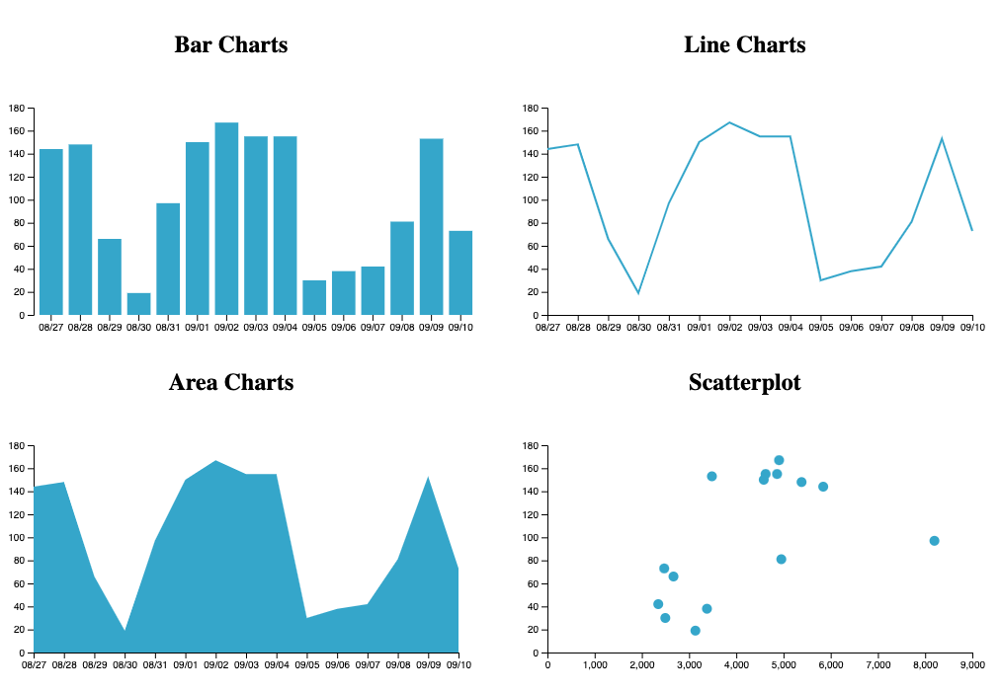
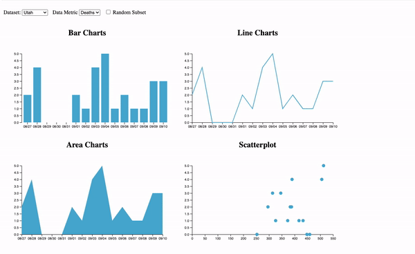

# CS-5630 / CS-6630 Homework 3

_Due: Friday, September 16, 11:59 pm._

In this assignment, you will make interactive charts with JavaScript and D3 to explore Covid-19 data.

## Implementation

We have provided boilerplate code in [hw3.html](hw3.html) and in [script.js](script.js).

As in previous homeworks, add your name, your e-mail address, and your uID to the HTML elements at the top.

The project structure should look like this:

    hw3/
        hw3.html
        README.md
        script.js
        data/
            covid_us.csv
            covid_utah.csv
            covid_ca.csv
            covid_ny.csv
        figures/

Remember, to be able to access the data files with JavaScript, we will need to be *serving* the homework directory, not just opening the HTML file in a browser. If your development environment doesn't provide a built-in server, start one with one of these commands:

    $ cd path/to/hw3
    # for python 3
    $ python -m http.server 8080

View the page at [http://localhost:8080](http://localhost:8080)

## Part I: Basic Events and Setup

In the boilerplate HTML we provide three controls: two “Select” menus for choosing a dataset and metrics, and a “Random Subset” checkbox. Attach event listeners to the menus and checkbox in the `setup()` function, so that they would call `changeData()` when the value changes. 

For this homework, you can add to html so that you have `<svg>` and some `<g>` elements to work with, or add those required elements in the `setup()` function, that will only be called once. The HTML also has some styling that you can use for different charts. 

## The Data
*This section is informational only, no need to implement anything.*

We've given you the code that loads and parses the CSV data depending on which option the user selects. `changeData()` imports the `.csv` file based on the output of menus, and output the corresponding data structure. The output is an array of objects, where the data has already been parsed:

```JSON
[...,
{cases: 5842, date: "08/27", deaths: 144},
{cases: 5383, date: "08/28", deaths: 148},
...]
```

Make sure to familiarize yourself with the data structure, e.g., by printing the object and exploring it in the console. 

Each object in the array has the date, cases, and deaths of COVID cases. `changeData()` calls `update()` with the output data, and `update()` is where the visualization will update based on the data. 

Implement each chart with the `data` input of `update()`. 

## Part II: Drawing the Visaulizations with D3

The bar chart, line chart, and area chart uses the date for x-axis, and the selected metric of the Data Metric drop-down for the values rendered on the y-axis. 
You can retrieve the value of the drop-down with `d3.select("#metric").node().value ;`. 

The scatterplot uses the cases for x-axis, and the deaths for y-axis.

1. Construct scales for each chart. (_hint: the y-axis for bar chart, line charts, and area charts are the same_)
2. Draw axis for each chart. 
3. Draw and update elements based on `data` input.

Using some constant "margin" can be helpful when placing an axis on a chart so that the axis labels are shown within the svg. We have some constants defined globally that you might find useful. But make sure that the scales are also adjusted when margins are incorporated. The scales should use `[0, maximum]` of the data visualized currently. The axes need to be transformed to the appropriate place. The scales and axes should update based on any change in the data.

For the bar chart and the scatterplot, use the data to populate your `rect` or `circle` elements. Position and size them correctly with the scales. 

For the line chart and area chart, the drawing will use a single `path` element. You can add the path in your HTML or in the `setup()` function. Binding and array to a single element will be different from the bar chart and the scatterplot, `datum()` instead of `data()`.

Note that `datum()` called with a data structure such as an array binds the **whole** array to a single element, instead of creating multiple elements. That makes sense for a line chart, because the `path` element we'll be using for that is just one element that is re-shaped based on all of the data, as opposed to multiple bars. 

 Use `d3.line()` and `d3.area()` to generate `d` attribute for the path. We've given you (commented-out) code for the line and area constructors in `update()`. 

We suggest to have the code for each chart in their seperate update functions, and call each chart update function in the main `update()` function. Adjust the chart update function inputs based on your need to draw the charts. 

Your final result should look somewhat like this:



## Extra Credit 1: More Events

We focus on interactivity in this class; you will usually implement interactivity with JavaScript. 
We suggest using D3 events for these. 

First, make rectangles in bar chart and points in scatter plot change color when the mouse hovers over it **using JavaScript**, not CSS hover styling. One way to do this is to make a `.hovered` class that uses a different fill. Assign elements to have the class when the mouse is on the element, and remove the class when the mouse leaves.

Your second interactive component will be to add an onClick listener to circles. When clicked, the browser should console log the x and y coordinates of that point to the console. 


## Extra Credit 2: Transitions

For extra credit, animate each D3 transition (gradually change sizes, positions, and shapes when switching datasets, and fade new and old items with opacity). As we will learn later in the course, animation is _very_ attention-grabbing; make sure your animations are tasteful and subtle. 


## Demo

Here is a demo of how the interactions could look like. You can also check out a higher resolution version [here](figures/hw3_demo.mov).




## Grading

Your score on this assignment will be as follows:

5%: The menus trigger the appropriate functions.  
4 * 15%: Each chart is rendered properly on page load (15% for each chart)  
15% The charts, including the axis update based on data change.  
10%: Elements are removed when "Random Subset" loads a smaller dataset.  
10%: Elements are created and styled appropriately when "Random Subset" loads a larger dataset.  
5%: Extra Credit 1: Elements change styles on hover and console log the data points on click.  
5%: Extra Credit 2: All D3 transitions are animated **tastefully**.
