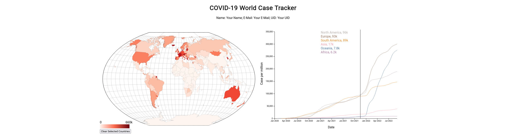
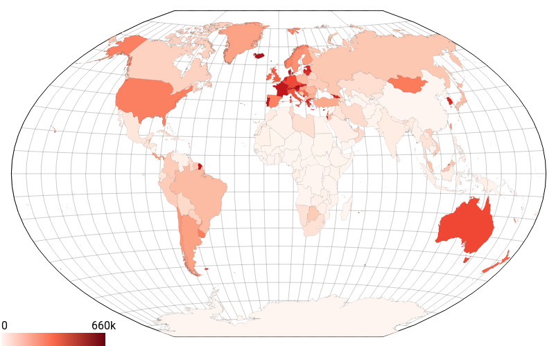
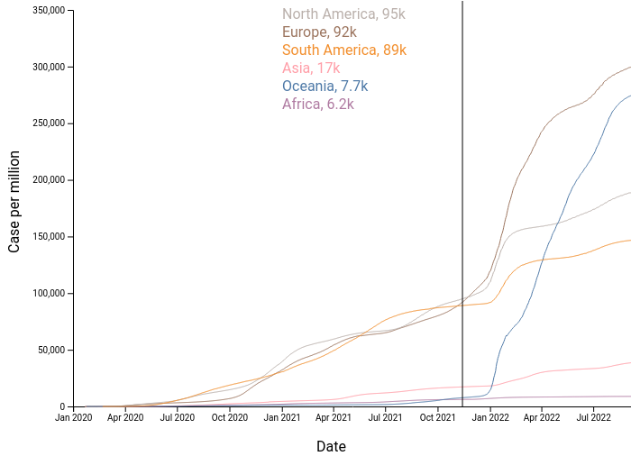
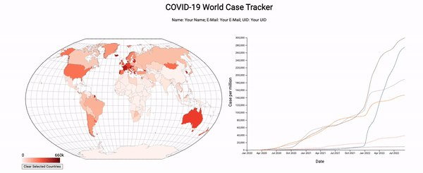

# CS-5630 / CS-6630 Homework 4
*Due: Friday, Sep 30, 11:59 pm.*

In this assignment you will build a visualization inspired by [OurWorldInData's](https://ourworldindata.org/covid-cases) COVID-19 dashboard. The visualization we will make is made up of two views: a map and a line chart.

The **map** provides geospatial context. Countries are color-coded with maximum cases per million residents and can be selected to update the line chart with a detailed view of that country.

The **line chart** has a couple of different states. The first is when there is no selected country. In this state, the chart shows the total cases for each continent over time. The second state is when we select a country (or countries) in the map view. When we do this, the visualization should change to show the case trends of just the selected countries.

When a country is selected in the map, the country is highlighted on the map and the line chart will show that country for detailed inspection. The final visualization should look similar to the figure below:



## Learning Goals

The learning goals for this homework are the following: 

 * Working with scales. 
 * Working with maps.
 * Dynamically updating charts.
 * Developing a visualization with multiple views that synchronizes selections.
  
## Project Structure

We have provided boilerplate code for you in `hw4.html` for the main structure of the layout and css styling in `styles.css`. You will be working within the `.js` files that we have provided for the map and line chart views. 

As in the previous homeworks, add your Name, UID, and email address at the top of the homework.

The project file structure looks like this:

    hw4.html
    readme.md
    styles.css
    data/
        grouped.json
        owid-covid.csv
        world.json
    js/
        line-chart.js
        map.js        
        script.js

Remember that you will need to be *serving* the homework directory, not just opening the HTML file in a browser. 

Before you submit you homework, you will want to make sure your submission is a valid html5 file. You can validate Check that it is valid by uploading it to the [W3C HTML Validator](https://validator.w3.org/#validate_by_upload).

## The Data

Your map will use GeoJSON data that is contained in the `world.json` file. For this assignment, we provide only one CSV data file that contains all the information that you'll need. The file `owid-covid.csv` contains COVID-19 data from the start of the pandemic until September 7th, 2022; take a look at the file to understand the structure. We've provided the data loading for you, and the data is passed to the corresponding view objects in `script.js`. 

Here is a sample of the COVID-19 data, please note that the `iso_code` field should match the `id` field in the world.json file (this will be useful for lookups later): 

```
iso_code,location,date,total_cases_per_million
AFG,Afghanistan,2020-02-24,0.125
AFG,Afghanistan,2020-02-25,0.125
AFG,Afghanistan,2020-02-26,0.125
AFG,Afghanistan,2020-02-27,0.125
...
EGY,Egypt,2022-09-05,4719.337
EGY,Egypt,2022-09-06,4719.337
EGY,Egypt,2022-09-07,4719.337
SLV,El Salvador,2020-03-19,0.158
SLV,El Salvador,2020-03-20,0.158
...
```

We created a global application state that is passed into each component that contains the data, the current selected countries, and reference to each component (so that one component may trigger another component to update). You will note how some fields are initialized to null and are reassigned as the data objects and components are created in script.js. 

```javascript
const globalApplicationState = {
    selectedLocations: [],
    covidData: null,
    mapData: null,
    worldMap: null,
    lineChart: null,
}
```

## Part 1. Map View



We are going to start by building a map. The first thing to do for this is to fill in `constructor()` in `map.js`. We have provided you with the projection, including the scaling and translation necessary to center it in the designated map area. Note that we use the Winkel Tripel projection, which is [used by the National Geographic Society for world maps](https://www.nationalgeographic.org/media/selecting-map-projection/). Winkel Tripel aims to minimizes all distortions (area, angle, distance); you'll learn more about this in the maps lecture. 

First, the necessary map data is available in the `globalApplicationState` in a property called `mapData`. This is TopoJSON, so will need to be handled accordingly. Please refer to the [maps coding lecture](http://dataviscourse.net/tutorials/lectures/lecture-maps/) for details on how to implement the map and how to deal with the TopoJSON.

Next, write the code that produces the map. When you have the outlines of the countries being drawn on your map, you can then color-code the countries by their maximum `total_cases_per_million` value. Do this by modifying the fill attribute for each country.

Also make sure that your map has the proper outline and 
ule (grid lines). You can use the `d3.geoGraticule()` function and the `graticule.outline()` to get the outline. It might make sense to add them in 2 steps so that you can style each individually.

The final piece of creating the map is setting up the clicking interaction. The interaction should allow you to select multiple countries for them to show up in the line chart. Clicking on an unselected country should select it, and clicking on a selected country should deselect it. You can handle this using the array in the `globalApplicationState` called `selectedLocations`. You can push when a country is clicked and [filter](https://developer.mozilla.org/en-US/docs/Web/JavaScript/Reference/Global_Objects/Array/filter) it out when you want to remove it from the selections. There is a function that you should call in the class called `updateSelectedCountries()`, which should contain all the logic to set a `selected` class on the countries. By externalizing this logic to that function, we can call that from another component to update the selection. This means we can also tell the line chart to update when a country is selected, but you will probably want to revisit this step when we've got the line chart rendering.

An additional piece that we'd like you to add is a legend. A good spot for this is in the bottom left corner of the svg. You'll need to use a [linear gradient](https://developer.mozilla.org/en-US/docs/Web/SVG/Tutorial/Gradients#linear_gradient) applied to an SVG rect with a couple of text elements. Please use `d3.format()` for the text (we will be using this in the line chart, too) so we don't end up with too much precision.

## Part 2. Line Chart



The line chart plot is deceptively tricky to get right. There are lots of pieces, and it can take a while to get the all styling correct, the data displaying as you want, and the interaction working as intended.

### 2.1 Data

The first obstacle to tackle is getting the data in the right format. For the lines, we recommend that you use the `d3.group` method, to create a group for each location to be plotted. In the initial state (in the `constructor()` method), this will be based on continents (you can find the continents by filtering the data based on the `iso_code` containing `OWID` as the first 4 characters) so let's filter the data to just the continents. Then we can group this data by the `location` property.

If you're struggling with this step, you may load in the json file, `data/grouped.json`, which provides a javascript object with this data already grouped. This will lead to a point deduction if you use this in your final solution, but you're welcome to use it while you focus on the visualization elements.

### 2.2 Axes

The next thing you should tackle is plotting the axes. You'll need to create a margin/padding on the left side and bottom side to allow space for the axes and the labels. We recommend `80px` on the left and `50px` on the right.

Use `d3.scaleTime()` for the xAxis, and `d3.scaleLinear()` for the yAxis. The tricky part will be figuring out the domain and the range for each scale. For the domain, you will likely need to leverage `d3.extent`, `d3.max`, or `d3.min` (more info at [these docs](https://github.com/d3/d3-array#extent)). You might also find the `array.map()` function helpful to get a single value from each object in the covid data arrays (array.map docs are [here](https://developer.mozilla.org/en-US/docs/Web/JavaScript/Reference/Global_Objects/Array/map)).

For the initial render in the `constructor()` method, we should make sure that the axes respect the data that we've filtered down to. This should be the continent level data.

This code snippet might be useful when creating the date axis. Think about which data to apply it to
```
map((row) => new Date(row.date))
```

Finally add some labels using SVG text elements. You can hard code the labels, as they don't rely on the data.

### 2.3 Lines

Now that you have axes visualized, we can add the lines. By doing it in this order, we now have access to the axes to help us with plotting.

We're going to use the grouped data from step 2.1 and create an SVG path for each group. The path will be the line on the line chart, and we will decide the shape of the line using the `d` attribute. We suggest that you use `d3.line()` inside the creation of the `d` attr, similar to the work you did in homework 3.

You'll need to create a color scale for the lines. We suggest that you set the scale up in the constructor and then modify when you need to (probably when we add interaction below). The scale should show a different color for each continent on initial render, and should do a decent job at no having too many overlapping colors when you start selecting countries.

### 2.4 Interaction

The next part of the line chart is the interaction. We envision that you will create an interaction where on hover, there will be a line displayed at the current mouse position, and a display of the `location` and `total_cases_per_million` at the date of the hovered position for each location that is plotted. See the image at the start of this section for a clearer understanding.

We suggest you create an `on('mousemove')` event listener on the line chart svg, which will get information about where the mouse is moved over the svg. You can then get the x position, subtract out the x position of the svg, and you'll be left with relative mouse position over the svg. Now, if the position is larger than the y axis position/padding, you can update the line on the SVG and its corresponding text elements.

As for adding the text, you'll want to use SVG text elements. You can use the same color scale as in 2.2 to match the color of the line to the color of the text on the interaction. The order of the text should be in the same order as the lines. For example, if Europe has the highest number of cases followed by North America, then the order of the text would be Europe on top, then North America underneath.

An additional wrinkle, the svg text shouldn't overflow the SVG in 95% of cases, because of some long country names. To fix this, move the text to the left side of the line, when the line is near the right edge of the SVG. This requires a small amount of logic when setting the x position of the text. You might find that the code is neater if you use a [ternary expression](https://developer.mozilla.org/en-US/docs/Web/JavaScript/Reference/Operators/Conditional_Operator) with 2 different offsets from the current mouse position.

Please make sure that as you change the selection, the line hides so that stale data is no longer displayed.

### 2.5 Updating from external cues

We have one final function to fill in, `updateSelectedCountries()`. This function will be called by the map component to trigger the line chart to re-render with updated countries. We can re-use some of the logic from above, but with a different subset of data selected. We want to make sure that when there are no `selectedLocations` in the `globalApplicationState`, that we plot all of the continents (this is the same as the original plotting from 2.2).

For this, you will mostly be copying logic from the constructor, but adding a bit of logic that will modify the data that is passed in when drawing the lines.

Another additional thing to think about is updating the y axis with a more appropriate domain. You should be modifying the domain to the extent of the data that is selected. This will make it easier to see trends in the data where the maximum value is much less than the maximum of the default state.

Note that if you skipped past this interaction step in the map creation steps above, now is the time to revisit it.

Here is the final visualization, and a higher resolution [video](figs/video.mov)


## Grading

30% Map view implementation – map is drawn, countries are colored by `total_cases_per_million`, graticule is drawn  
20% Data grouping for the line chart  
30% Line chart implementation – line chart is drawn with continents as default, updates when the map is clicked, has interaction to show values at mouse location  
20% Interactions, selections on update line chart, and "Clear Selected Countries" remove selections on both the map and the line chart. 
