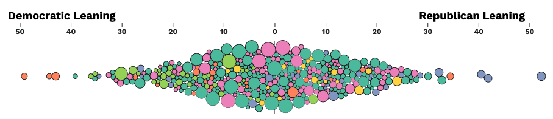
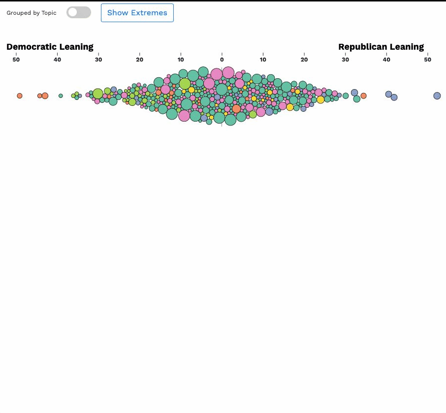
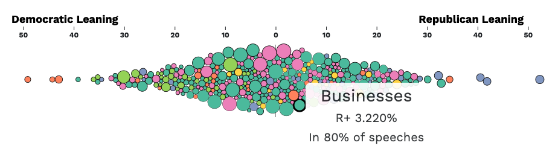
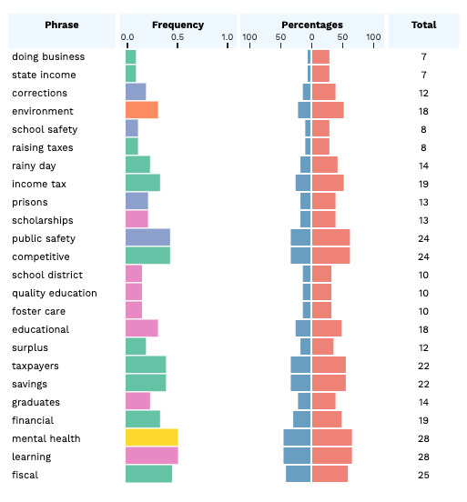
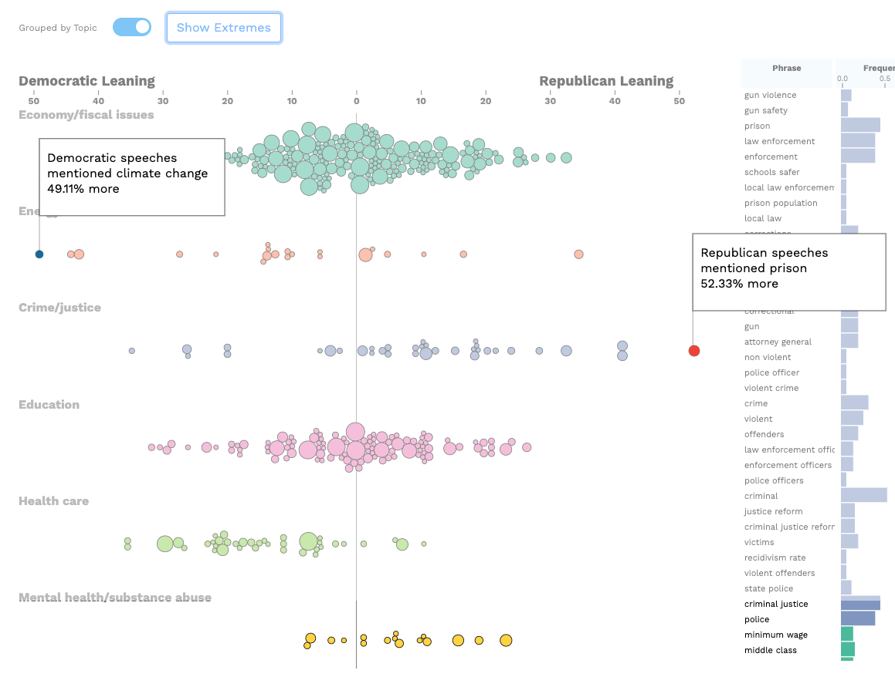

# CS-5630 / CS-6630 Homework 6
*Due: Friday, November 4, 11:59 pm.*

In this assignment, you will build an interactive visualization to explore the political polarity of words used in US governors' state of the state addresses. The visualization is inspired by the NY Times visualization of [corporate tax rates](https://archive.nytimes.com/www.nytimes.com/interactive/2013/05/25/sunday-review/corporate-taxes.html) we discussed in lecture.

We've retrieved the data from [538's public data repositories](https://github.com/fivethirtyeight/data/blob/master/state-of-the-state/words.csv).

## Visualization Design

## Learning Goals
We're not providing code stubs for this homework; so one of the learning goals is to explore how to design such a visualizations. Most of what you will implementing is already familiar, with the exception of burshes and (basic) storytelling functionality.

[Here](assets/demo.mov) is a demo of the functionality..

## Implementation

As in previous homeworks, add your name, your e-mail address, and your UID to the HTML elements at the top. Also make sure your submission is a valid HTML5 file. Check that it is valid by uploading it to the [W3C HTML Validator](https://validator.w3.org/#validate_by_upload).

Other than adding your name, etc., you should not need to edit the html file in this assignment (though you are free to do so.)

You have the freedom to implement the views how you want, however, we recommend using good web development practices. For example, it is advisable to create at least one javascript file for each view, but you can organize the code however you see fit. We have given you an html file and 2 data files (`words.js` and `words-without-force-positions.csv`). You will be graded on the final appearance and interaction; they should match or improve upon our examples.

## The Data
The data set is a collection of N-grams that are taken from US governors' state of the state addresses. The team at 538 conducted a textual analysis of the resulting N-grams to see what issues were talked about the most and whether there were differences between what Democratic and Republican governors were focusing on. We will be plotting the N-grams along a diverging x-axis to see the differences between words used in Democratic and Republican speeches.

## Part 1. Loading the Data
We have provided one `words.json` file for you that will have all of the data you need to implement. This will be used for both the bubble chart and the table view. 

### (HACKER CHALLENGE) Implement the Simulation

We have provided the `x` and `y` positions generated by a [`d3.force`](https://github.com/d3/d3-force) layout for before and after the group separation. For the hacker version, you will implement your own simulation to get the positions for the bubble chart using the `words-without-force-simulation.csv` data file. 

You can choose to do this in a separate function before rendering the bubble chart (saving the positions to your data object), or integrated into your bubble chart. 

To do this, you will need to create a `d3.forceSimulation()`, passing the data to the nodes property of the simulation.

If you are planning to run the simulation before rendering and you are saving the positions, it is helpful to understand that you want to run the tick function of the simulation until it reaches an optimal spacing. A good example of that is from [Mike Bostock](https://bl.ocks.org/mbostock/1667139).

## Part 2: Bubblechart
The bubble chart (beeswarm chart) shows all of the N-grams along a divergent x-axis by percent difference. N-grams used more by democrats appear left of the chart, while those used more by republicans appear on the right. The x and y position for the circles is determined by the `sourceX` and `sourceY` property in the data. The size of the circle encodes the total count which is the `total` property in the data. Circle color encodes the category of the N-gram. You will need to create a size scale and color scale for the circles. The positions are provided for you, or given by the simulation if you attempt the hacker version. For more information on the different kind of scales (and how you can create scales for categorical attributes) you can read more about it [here.](https://github.com/d3/d3-scale).

### Part 2A: Toggle between overall and grouped layout
Create a button or toggle (we used a toggle) to separate the beeswarm plot into the N-gram categories. When you click the button or toggle, the groups should be separated in y direction (using position as an encoding for the categories). When you click the toggle again, all circles should return to the one plot. Animate your transitions and make sure you move the points correctly using a key function. The categories to color the circles are the same categories that you are separating them on. The x and y position for the separated categories are the `moveX` and `moveY` properties in the data.

As an alternative (depending how you are implementing your plot), there is an optional y position property `correctedY` that allows you to use that with your own y scale if you wish. 

### Part 2B: Tooltip for circle hover
You will need to create a tooltip that shows the N-gram, the political difference (`position` in the data), and the total frequency of the N-grams use (needs to be calculated using the `total` divided by 50).

#### Summary of the things you need for the bubblechart:
* Bubblechart with two states: together and separated by group. Transitions are animated.
* Toggle or button that toggles the separation of the categories.
* Size of circle encodes total use of N-gram.
* Circles are colored by category
* A diverging x-axis shows the partisan use of each word.
* Tooltip that shows N-gram, political difference, and total frequency.

## Part 3: Table
The second major view that you will implement is the table. This uses the same data set, however, you should create these headers `Phrase, Frequency, Percentages, and Total`. These will be the columns for your table. The phrase is the N-gram (`phrase` in the data). The frequency is the same as that which you have calculated for the tooltip. The percentages column will encode both the republican and democratic percentages for the N-gram. The Total is the `total` property. Two of the four columns should use bar charts as a visual encoding.

### Part 3A: Clicking on the headers sorts the data table ascending / descending
When you click on the headers, the table should be sorted by that column. Clicking again should invert the sorting.

#### Summary of the things you need for the table:
* Phrase, Frequency, Percentages, and Total columns
* Sorting by headers.
* Two of the four columns should be a visual encoding.

## Part 4. Brushes
You should be able to brush the grouped version and the separated version of the bubble plot. By brushing, you update what is seen in the table view. If you click on the bubble plot, the brushes should clear.They should clear on toggling group by topic. For more information on brushes, see the d3 documentation on [brushes](https://github.com/d3/d3-brush).

Here's how brushes should work:

## Part 5. Storytelling
For the example, we highlighted the most extreme terms for both political parties, but you can highlight whatever you find interesting in the data. We recommend that you create a div that will overlay the entire screen that explains something about your data. This will be triggered by a button. It should disappear on mouse click.
 

#### Summary of the things you need for storytelling:
* Highlight something about the data that you find interesting.
* The user should be able to show the panel with the highlight and then remove the panel in a controlled way.

## Grading

* 10%: Part I (HACKER VERSION EXTRA CREDIT): Data is loaded from the CSV file. JSON file isn't used.   
* 35%: Part II: Bubblechart.  
* 35%: Part III: Table.   
* 20%: Part IV: Brush.
* 10%: Part V: Storytelling.     

